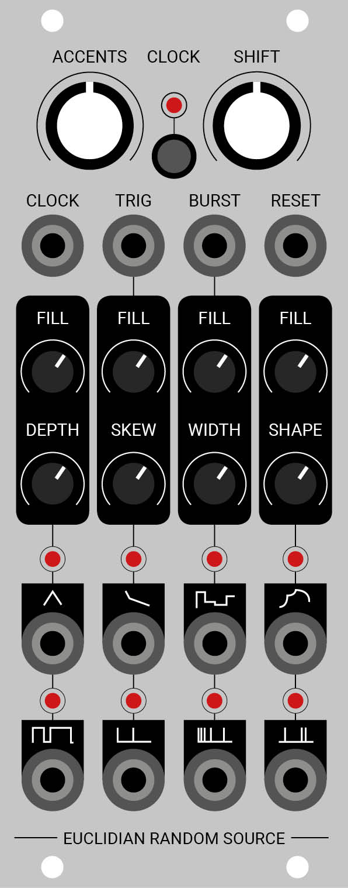

# EUCLIDIAN RANDOM SOURCE
</a>

## Features
- 8 random voltages
	* Triangle
	* Curved
	* Stepped
	* Skewed
	* Gate with random length
	* Trigger with a 50% chance
	* Burst
	* Noise

## Specs
- Cortex-M4 ARM 72mHz (STM32F3)
- 14 bit DAC

## Credits
- Pichenettes		https://github.com/pichenettes

## License

